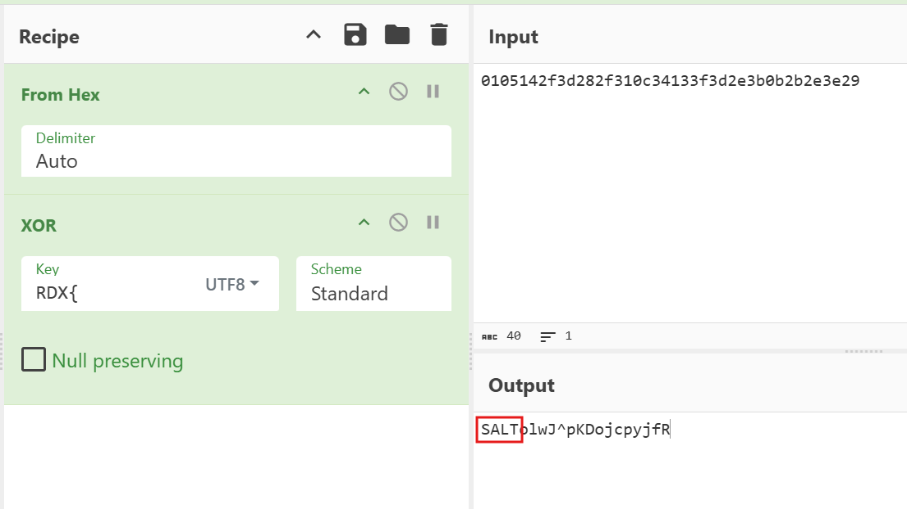

# DotPad

**Author:** Abdul Moiz

## Challenge Description
What gibberish is this??

Flag Format: `RDX{flag}`

## Writeup

We are given two encrypted image files: `encrypted1.png` and `encrypted2.png`. The challenge name "DotPad" hints at the use of a **One-Time Pad (OTP)** encryption. When two images are encrypted with the same pad, XORing them together cancels out the key.

### Step 1: XOR the Encrypted Images

First, we XOR the two images together in grayscale to reveal the XOR of their plaintexts.

Python script to XOR the images:

```python
import cv2
import numpy as np

def xor_images(image1_path, image2_path, output_path="xored_output.png"):
    # Load encrypted images as grayscale
    enc1 = cv2.imread(image1_path, cv2.IMREAD_GRAYSCALE)
    enc2 = cv2.imread(image2_path, cv2.IMREAD_GRAYSCALE)

    if enc1 is None or enc2 is None:
        raise ValueError("Error loading images. Check file paths!")

    if enc1.shape != enc2.shape:
        raise ValueError("Images must have the same dimensions for XOR operation.")

    # XOR both encrypted images (C1 ⊕ C2 = P1 ⊕ K ⊕ P2 ⊕ K = P1 ⊕ P2)
    xored_output = cv2.bitwise_xor(enc1, enc2)

    cv2.imwrite(output_path, xored_output)
    print(f"XOR operation complete! Output saved as '{output_path}'.")

xor_images("encrypted1.png", "encrypted2.png")
```

### Step 2: Extract the Hidden Hex String

After running the script, open `xored_output.png`. You will see a sequence of hex values:


`0105142f3d282f310c34133f3d2e3b0b2b2e3e29`

### Step 3: Analyze the Hex String

Paste the hex string into CyberChef and decode from hex. We see gibberish!!! 

The img said "MORE XOR??" so we will  try XORing it with the flag format `RDX{` to look for a repeating key.



The repeating key is revealed as **SALT**.

### Step 4: Recover the Flag

Use the key "SALT" to XOR the hex string and reveal the flag.

The final flag is:
`RDX{nice_u_know_xor}`