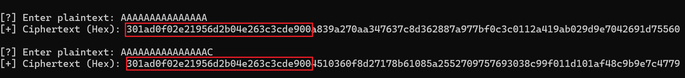

# Electric Cooker Box

**Author**: Abdul Moiz

### **Challenge Description**
I used the flag as my padding, but I think I made a mistake. Can you help me out?

---

## **Challenge Analysis**

The server gives us an oracle that encrypts **`plaintext + FLAG`** using **AES-ECB** mode (infered from the words `padding` and `Electirc Cooker Box`'s initial **E C B**...xd) with a random key and padding. Since the key is unknown but fixed during a session, and **AES-ECB leaks block patterns**, we can perform a classic **byte-at-a-time ECB attack** to recover the flag.

### **Provided behavior:**

- You can send **any plaintext** to the oracle.
- It will append the secret **flag** to your input.
- It will then **pad** and **encrypt** using **AES-ECB** mode.
- Finally, it returns the ciphertext.

---

## **Vulnerability**

ECB mode leaks information because it encrypts **each 16-byte block independently**. Identical plaintext blocks will always result in identical ciphertext blocks. This makes ECB mode vulnerable to block-based oracle attacks.

Since we control the prefix (our input), and the flag is appended **after** it, we can align and leak the flag byte-by-byte by observing repeated ciphertext blocks.

---

## **Exploit Strategy**

### The idea:


Lets assume the first char is `C`, to verify we first send `'A'*15` and the oracle will pad it with the last byte of the `FLAG` to match the block size. We then send `'A'*15 + 'C'` and compare the first block of the ciphertext with the first block of the previous ciphertext. If they match, we found the first char of the flag.


As visible the first block of both cipher's is same hence the first char of the flag is `C`, we can repeat this process to get the entire flag


---

## **Proof of Concept Code**

```python
from pwn import *
from Crypto.Util.Padding import pad

BLOCK_SIZE = 16

def chunks(data, size):
    return [data[i:i+size] for i in range(0, len(data), size)]


charset = b'_abcdefghijklmnopqrstuvwxyzABCDEFGHIJKLMNOPQRSTUVWXYZ0123456789'

io = remote('HOST', PORT)

known_flag = b''

for i in range(1, 50):
    pad_len = BLOCK_SIZE - (len(known_flag) % BLOCK_SIZE) - 1
    prefix = b'A' * pad_len
    io.recvuntil(b'[?] Enter plaintext: ')
    io.sendline(prefix)
    cipher_hex = io.recvline_contains(b'Ciphertext').decode().split(': ')[1]
    cipher = bytes.fromhex(cipher_hex)
    target_block = chunks(cipher, BLOCK_SIZE)[len(known_flag) // BLOCK_SIZE]

    # brute force with charset
    for c in charset:
        guess = prefix + known_flag + bytes([c])
        guess_padded = pad(guess, BLOCK_SIZE)
        io.recvuntil(b'[?] Enter plaintext: ')
        io.sendline(guess[:-1])
        cipher_hex_guess = io.recvline_contains(b'Ciphertext').decode().split(': ')[1]
        guess_cipher = bytes.fromhex(cipher_hex_guess)
        guess_block = chunks(guess_cipher, BLOCK_SIZE)[len(known_flag) // BLOCK_SIZE]

        if guess_block == target_block:
            known_flag += bytes([c])
            print(f'[+] Found byte: {bytes([c])} -> {known_flag}')
            break

print(f'Flag: {known_flag.decode()}')
