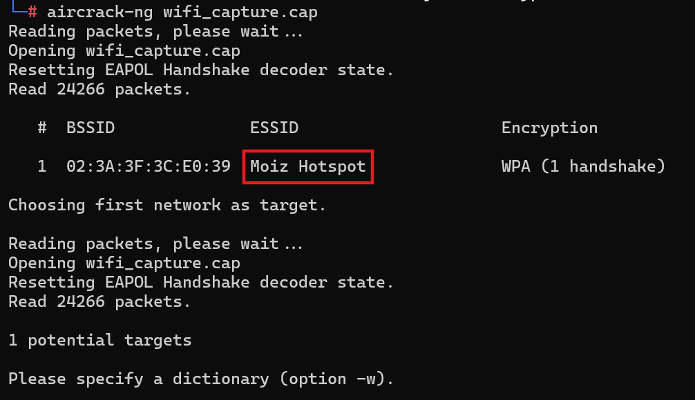
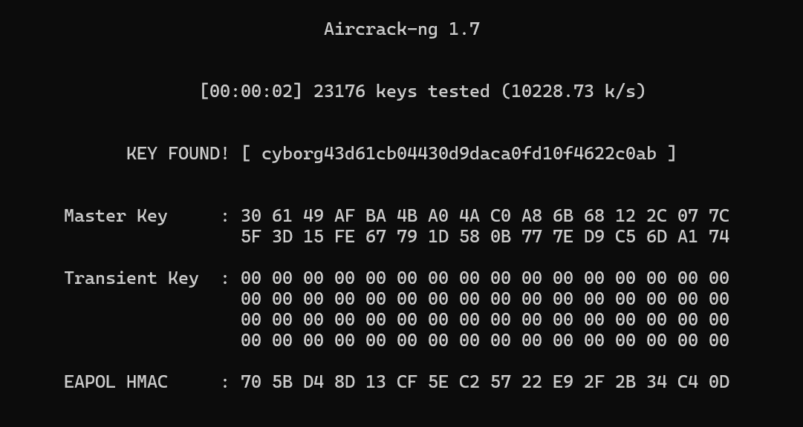

# Unbreakable Wifi

**Author:** `Abdul Moiz`

## Challenge Description
I heard my wifi's password was in a breach database?? So I added the md5 hash of my wifi's name at the end of my password just to be safe.

**Flag Format:** `RDX{password}`

## Writeup

We are given a `.cap` file containing a WiFi handshake capture. The challenge hints that the WiFi password was in a breach database, and the author appended the MD5 hash of the WiFi's name (SSID) to the end of the password.  

### Step 1: Inspect the Capture File

First, we need to extract the SSID from the capture file.  
Use `aircrack-ng` to inspect the file:

```bash
aircrack-ng wifi_capture.cap
```

*Example output:*



From the output, we find the SSID is:  
**Moiz Hotspot**

### Step 2: Calculate the MD5 Hash of the SSID

The challenge states the MD5 hash of the SSID is appended to the password.  
Calculate the hash:

```bash
echo -n "Moiz Hotspot" | md5sum
```

**Output:**  
`43d61cb04430d9daca0fd10f4622c0ab`

### Step 3: Prepare the Wordlist

Since the password is from a breach database, we use a popular wordlist like `rockyou.txt`.  
We need to append the MD5 hash to every entry in the wordlist.  
This can be done efficiently using `awk`:

```bash
awk '{print $0 "43d61cb04430d9daca0fd10f4622c0ab"}' rockyou.txt > modified_wordlist.txt
```

Alternatively, pipe directly to `aircrack-ng`:

```bash
awk '{print $0 "43d61cb04430d9daca0fd10f4622c0ab"}' rockyou.txt | aircrack-ng wifi_capture.cap -w - -e "Moiz Hotspot"
```

- `-w -` tells `aircrack-ng` to read passwords from stdin.
- `-e "Moiz Hotspot"` specifies the target SSID.

### Step 4: Crack the Password

Run the above command and wait for `aircrack-ng` to find the correct password.




The password found is:  
**cyborg43d61cb04430d9daca0fd10f4622c0ab**


So the final flag is:
`RDX{cyborg43d61cb04430d9daca0fd10f4622c0ab}`
