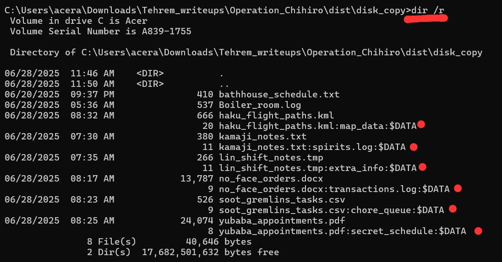
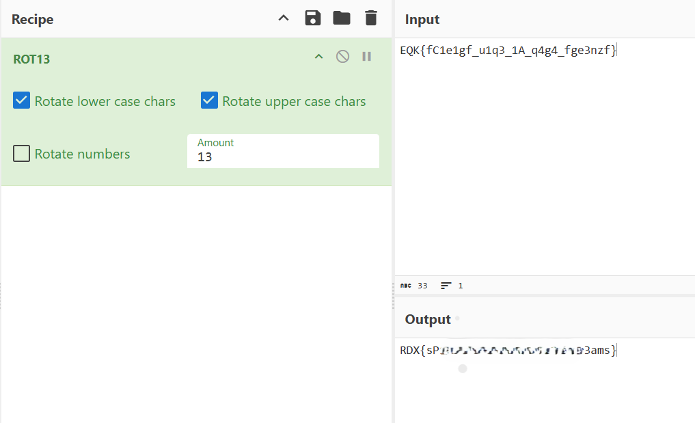

## **Operation Chihiro**  

Author: Tehrem

### Solution:

We're given a dist_copy.rar file, After extracting it, we get multiple files: 
- `bathhouse_schedule.txt`  
- `kamaji_notes.txt`
- `no_face_orders.docx`
- `soot_grelims_tasks.csv`
- `yubaba_appointments.pdf`
- `lin_shift_notes.tmp`
- `haku_flight_paths.kml`
- `boiler_room.log`

After analyzing the files, we get nothing. The description isn't much of a help either. But if we look at the file name, `disk_copy`, it hints something. 

**Disk** evokes low-level storage or filesystem structures. **Copy** implies duplication, maybe something was copied into the file, but not visible. This could mean that the challenge uses Alternate Data Streams (ADS) to hide the flag!!

Now if you didn't know about ADS: 

It is a `NTFS` file system feature, and files with hidden streams can exist without changing the visible content — just like something could be "copied" invisibly.

We can check the existence of data streams with the command: 

```bash
dir /r 
```



The next steps are easy. To display the content of a stream, run the command:
```bash
more < haku_flight_paths.kml:map_data
```
This one was a decoy, as I got `u4xh_y0i3f_Q3p0lf` which is ROT13 of `h4ku_l0v3s_D3c0ys`.

After checking the other streams, I got the following data:
1. **kamaji_notes.txt:spirits.log**: `EQK{fC1e`
2. **lin_shift_notes.tmp:extra_info**: `1gf_u1q3`
3. **no_face_orders.docx:transactions.log**: `_1A_q4`
4. **soot_gremlins_tasks.csv:chore_queue**: `g4_fge`
5. **yubaba_appointments.pdf:secret_schedule**: `3nzf}`

When put together and decoded with ROT13, we get the flag!! 




 
