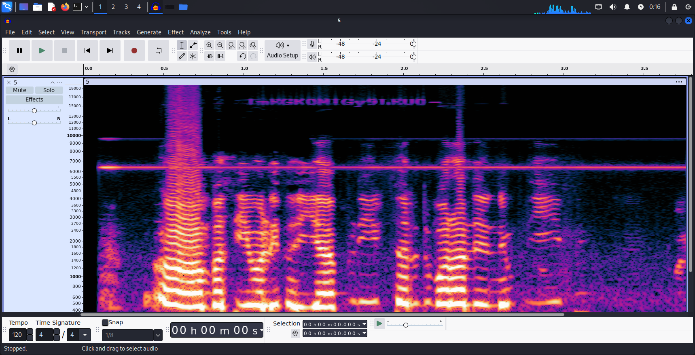
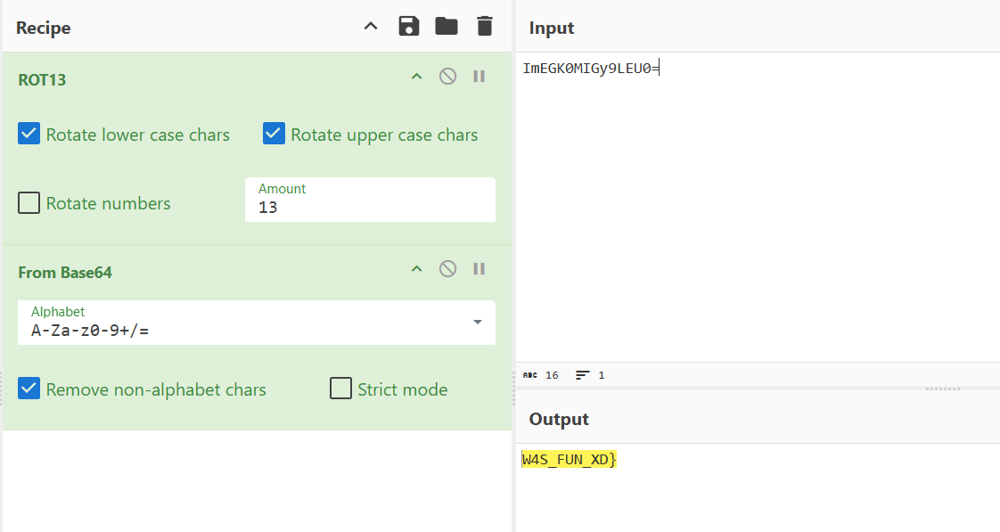
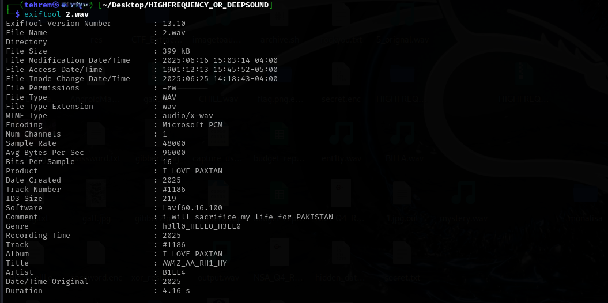
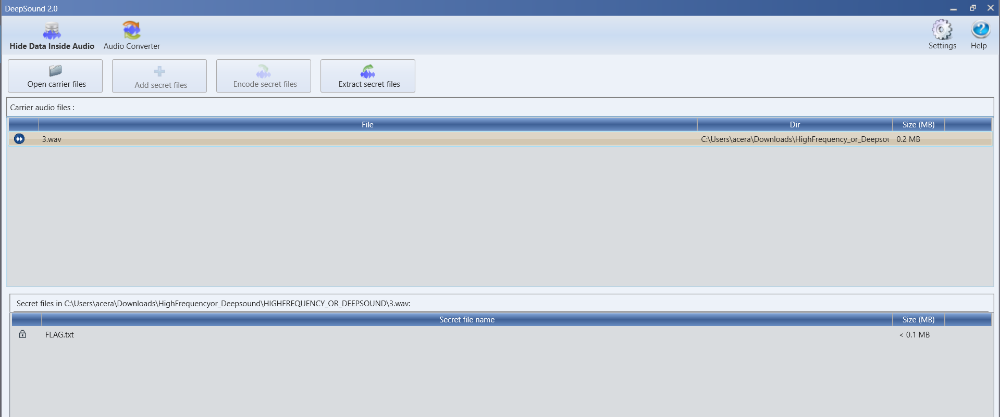
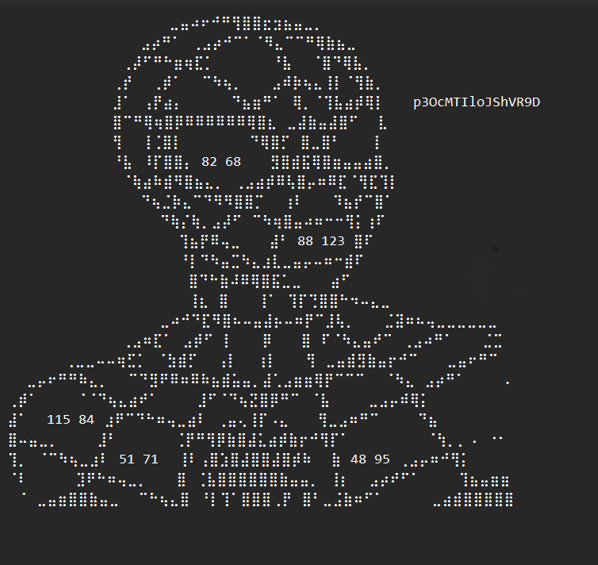

## **High Frequency or DeepSound?**

**Author:** Tehrem

### Solution:

We're given a zip file that contains five .wav files. The audio content is random. While some audios have very low and deepsound, the others have an annoyingly high frequency. 

As it is an audio challenge, we must check for the spectogram of all the files. And good for us we do have a encoded text in the spectogram of the last audio file that can lead us to the flag!

After decoding it we get: 

 only half of the flag.

 Let's search for the first half. I checked the metadata of the files and found a few codes. 

 

h3ll0_HELLO_H3LL0, AW4Z_AA_RH1_HY, I LOVE PAXTAN, B1LL4

There weren't any other clues. But wait- the name of the challenge! `DEEPSOUND` is a software used to embed any multimedia file inside an audio file. 

After downloading it, I tried opening the audio files. For 3.wav it asked for password. Now let's bruteforce the codes we got before.

AW4Z_AA_RH1_HY worked and there we have our FLAG.txt!!

 

Extract the file and we get a SPIDERMAN. Damn. It has some encoded text on the side and decimals scattered all over it.

 

The text is just "spiderman op". Well not the flag. So there is something to do with the numbers. Decode it to ASCII, from decimal and we get the first part of the flag!