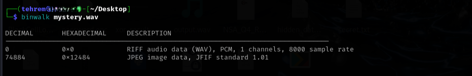
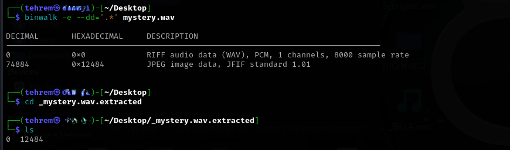
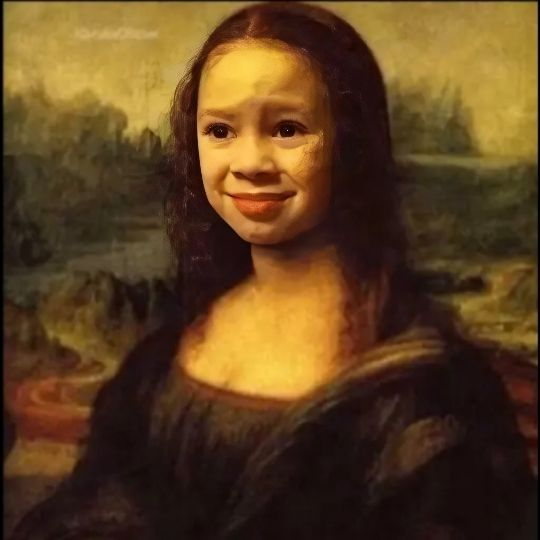
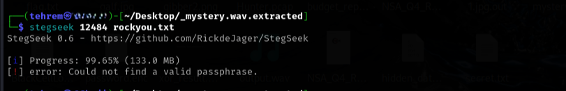
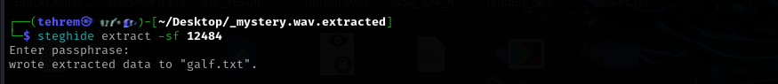

## **The Da Vinci Mystery**  

**Author:** Tehrem

### Solution:

We're given a morse code. When decoded online, we get `L4GIOCONDA` 

La Gioconda is the italian name of the famous painting- Monalisa by Leonardo Da Vinci. But the audio just gave us a code word that can possibly help us later in the challenge.

 Let's refer the description again, it mentions "deep under the layers", which could mean embedded files! Let's binwalk the audio file. 

We do have files to work with. Now to extract them, run the command:

In the extracted directory, we have an audio file `0` (replica of the orignal mystery.wav) and an image file `12484` 

Monsalisa!! a little twisted tho.

There can be more "layers" in this image. Let's check with `stegseek` first.

Uhh nothing matched. Let's try `steghide` and as for the passphrase we can try the code we got from the audio file in the beginning.

It worked! We get a galf.txt with a string, reverse it to get the flag.

