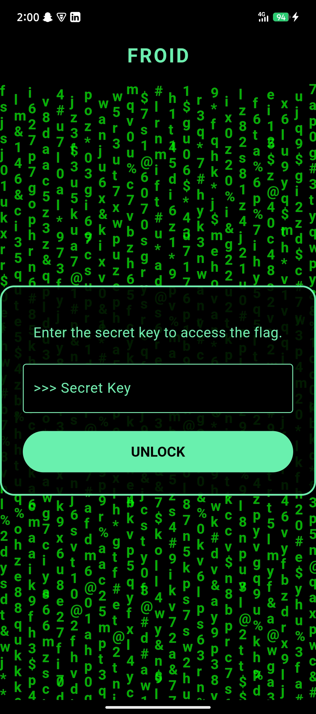
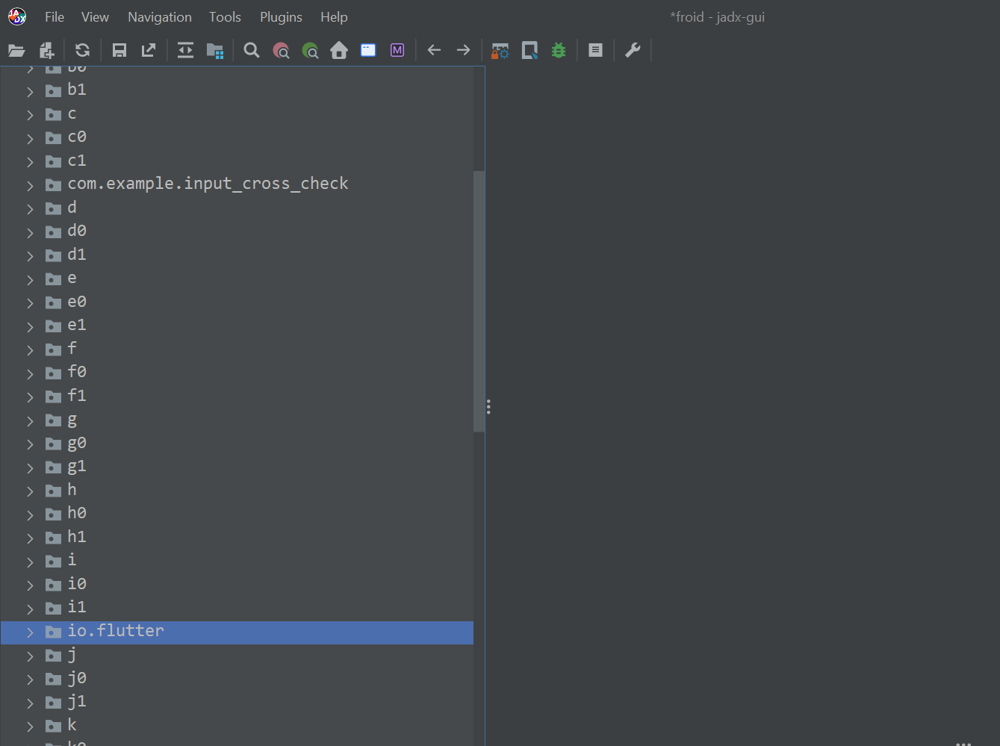
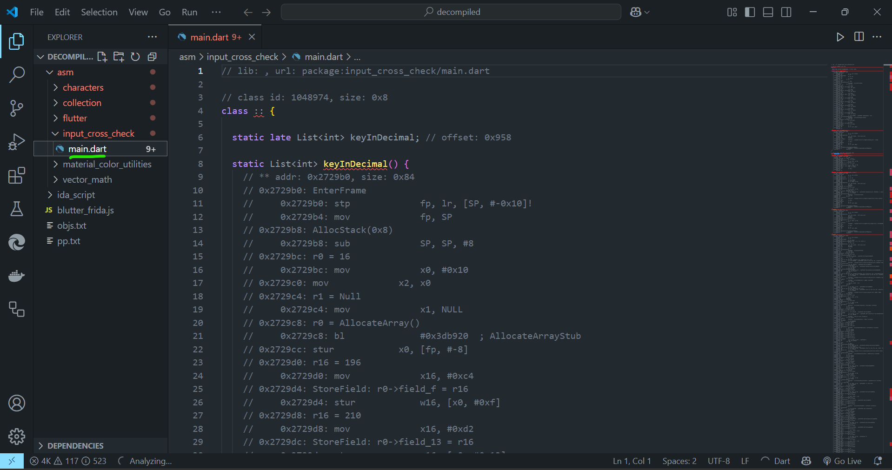
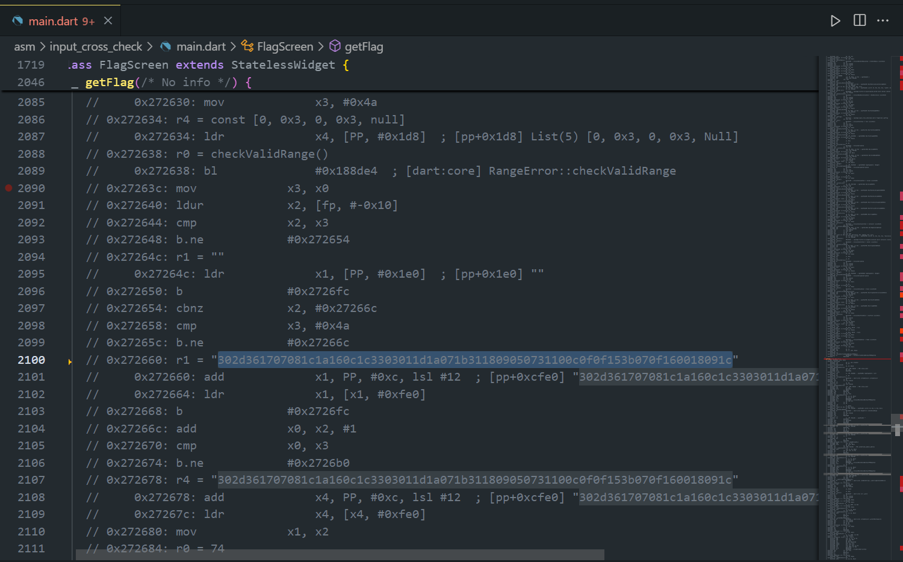
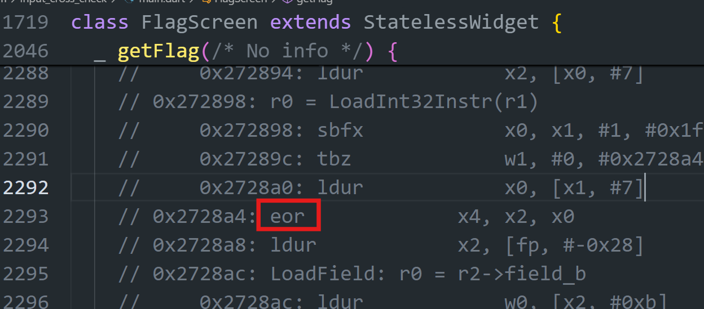
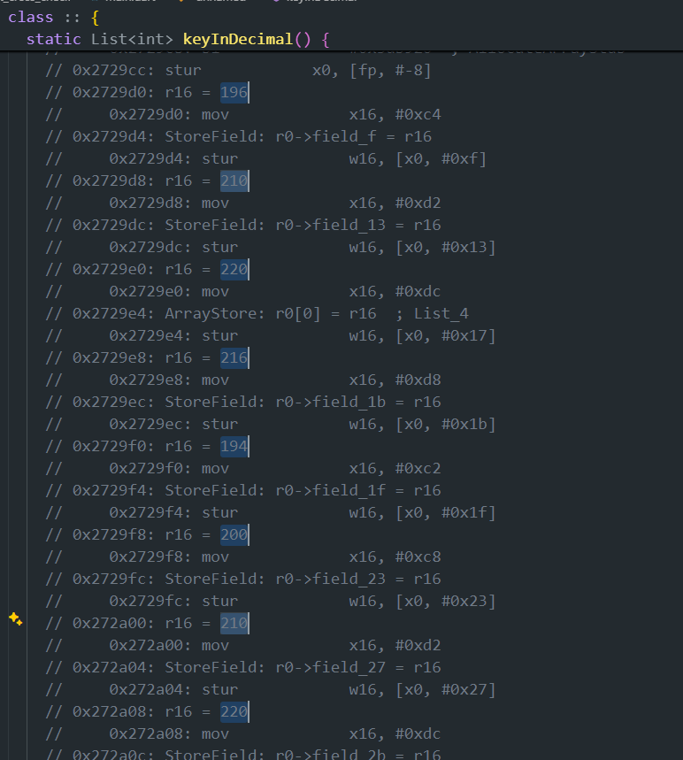

# Froid

**Author:** `Abdul Moiz`

## Challenge Description
I forgot my password can you help me recover it?

## Writeup

We are given a `.apk` file and upon installing it in our android emulator we see the following:  



An app asking us to enter the key to access the flag

(And yes `strings` doesn't directly expose the key or the flag)

### Step 1: Decompile using JADX

We load the apk file into JADX and wait for it to automatically do the decomilation

After decompilation scrolling down in the source code category we see "flutter" which is a popular cross-platform language by google used to develop mobile apps




So for this we will use a flutter speciic decompiler called `blutter`


### Step 2: Using Blutter for decompiling the flutter app

After installing blutter we run:

```bash
python3 blutter.py froid.apk decompiled
```

Blutter generates for us multiple files and folders, in one of them we see `main.dart` which is the entry point for a flutter application



### Step 3: Making sense of the decompiled functions

We see a huge string in the getFlag() method which looks like a hex string but decoding it doesn't give us anything.

`302d361707081c1a160c1c3303011d1a071b311809050731100c0f0f153b070f160018091c`



But we do later in the code see a `xor` instruction which is used to decode this string with the key



### Step 4: Finding the key
Now there are primarily 2 ways to find the key:

i) the method `keyInDecimal()` is decompiled but the hardcoded key is to be divided by 2 (this info is not present in the decompiled code anywhere) due to the way flutter compiler optimizes the compilation process. Another way to know this would be to recreate the app hardcode a random key yourself and then find out what optimization is done by the compiler



This gives:
```
[196, 210, 220, 216, 194, 200, 210, 220]
```
which after dividing by 2 gives us the key:
```
[98, 105, 110, 108, 97, 100, 105, 110]
```
which when decoded from decimal representation is:
`binladin` which is the key we need to access the flag


ii) The other way to find the key is to XOR the enc string (flag) with the flag format `RDX{`


This give us the first 4 letters and by crib-dragging we can guess the key to be `binladin` as well

### Step 5: Getting the flag

Both entering the key into the app or manually decoding the flag gives us the same result.

`RDX{flutter_better_than_react_native}`