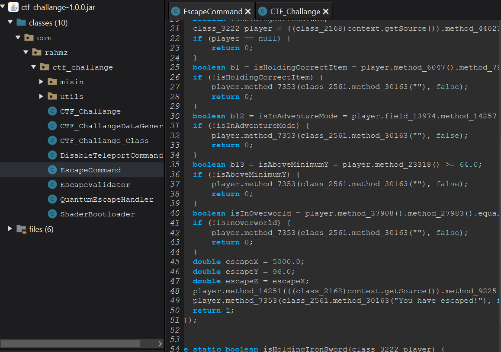

# Minecraft Modding

#### **Prepared By**: Abdul Rahim
## Description
I made a Minecraft mod that can help you retrieve the flag. Can you find it?

Map Link:
https://drive.google.com/file/u/1/d/1mtG4fvyvArvRu6DJTGQP06Oqu5SBCi8e/view?usp=sharing

# Solution
The challenge provides a Minecraft mod in the form of a JAR file. To solve this challenge, we need to analyze the mod file to understand its functionality and find the flag.
After decompiling the JAR file using Recaf, we see a Class "Escape Command" with a lot of junk code. But this command takes us to some hard coded co-ordinates (5000 , 96 , 5000) in the Minecraft world and once we go there there is a lectern with a book and flag is written on it.

# Flag
RDX{M1n3Cr4f7_M0dd1ng_15_H4ck1ng_3478923749328}
